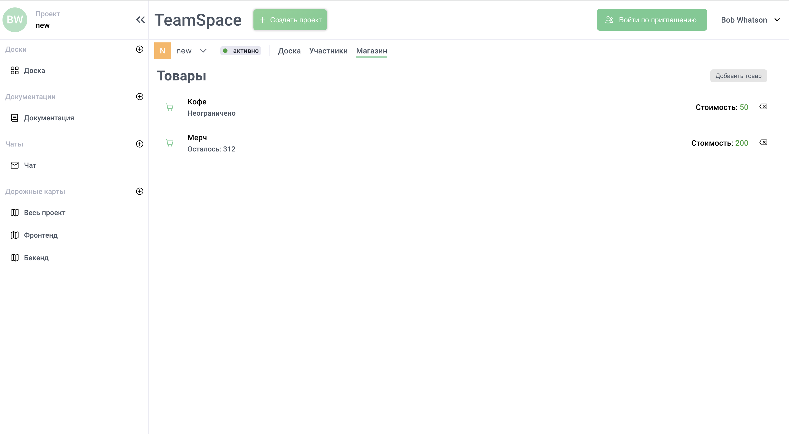

# Teamspace

`/teamspace/kanban-board`


`/teamspace/docs`


`/teamspace/chats`


`/teamspace/shop`



`/teamspace/roadmaps`


---

## Быстрый старт

1.  **Склонируйте репозиторий.**

    ```sh
    git clone https://github.com/mnenie/teamspace-hack.git
    ```

2.  **Начните просмотр.**

    Перейдите в директорию `client` и запустите проект на стороне frontend.

    ```sh
    cd client
    npm install
    npm run dev
    ```

    Перейдите в директорию `server` и запустите проект на стороне backend.

    ```sh
    cd server
    npm install
    npm run dev
    ```